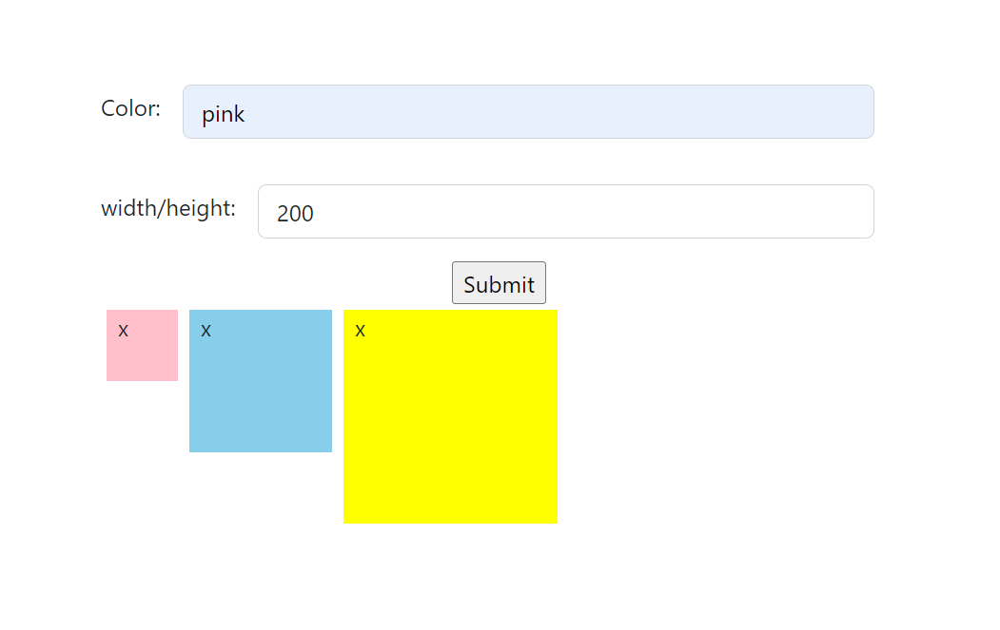
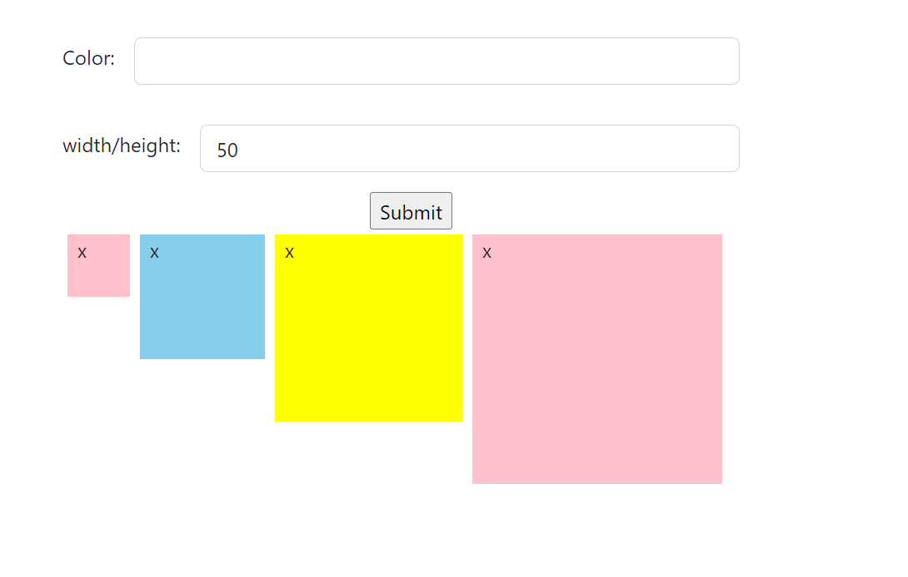
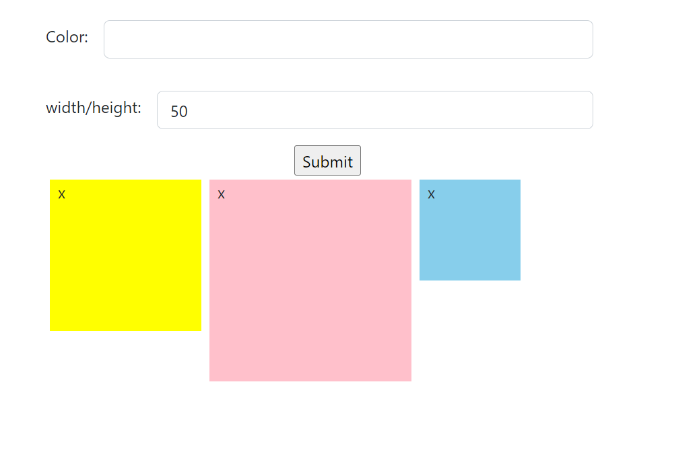

# box-generator
a simple react application to generate boxes depends on the color and width/height the user entered, it also allow deleteing boxes 
### Enter color and width/height

### After submitting info, it generate the Box 

### After deleting the two first boxes

